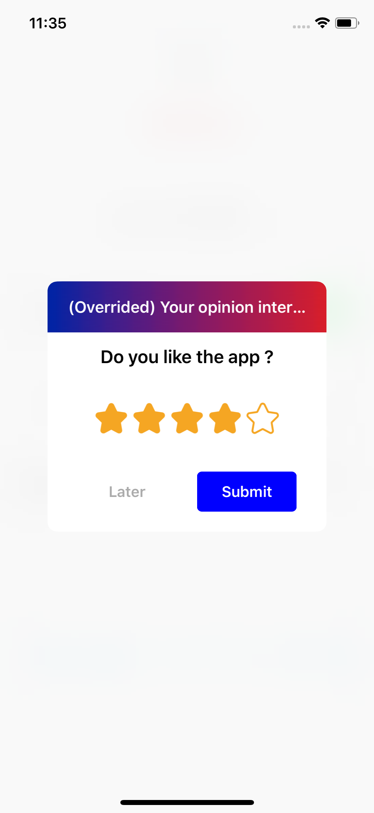
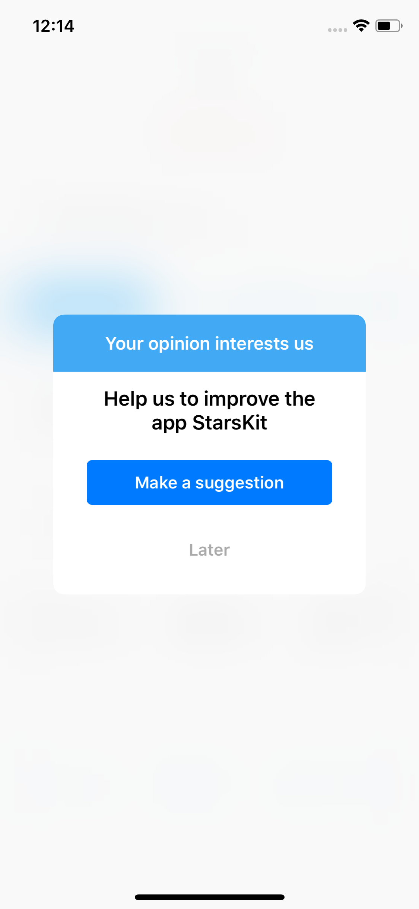
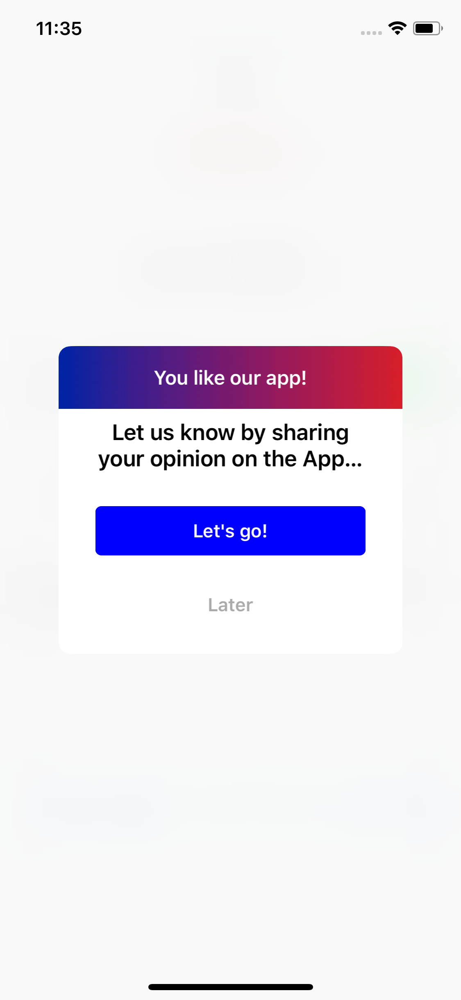
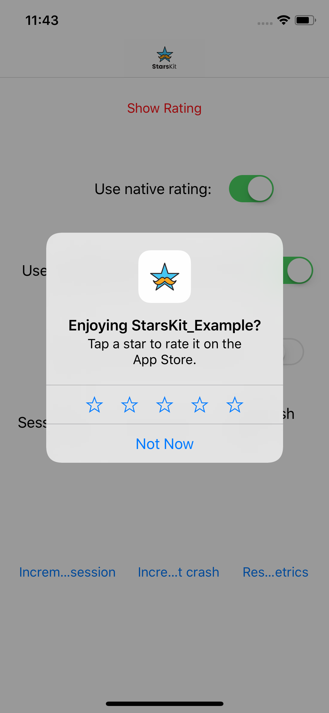
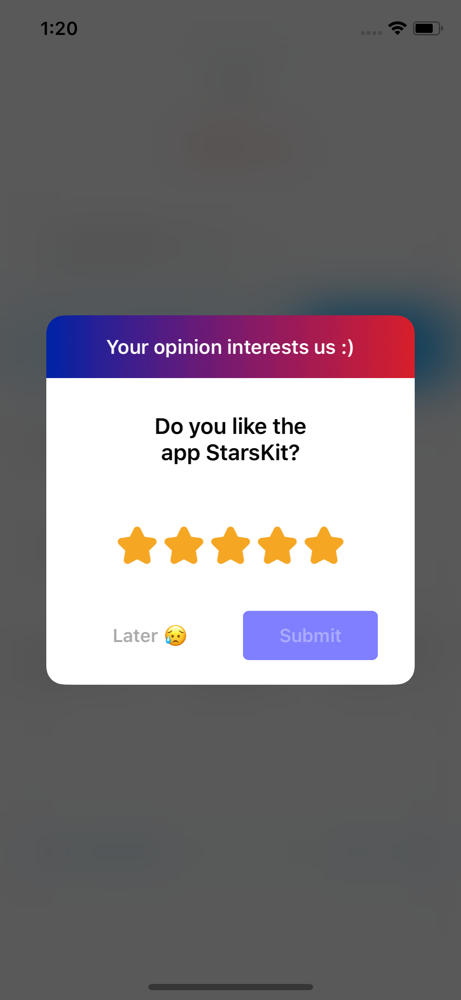
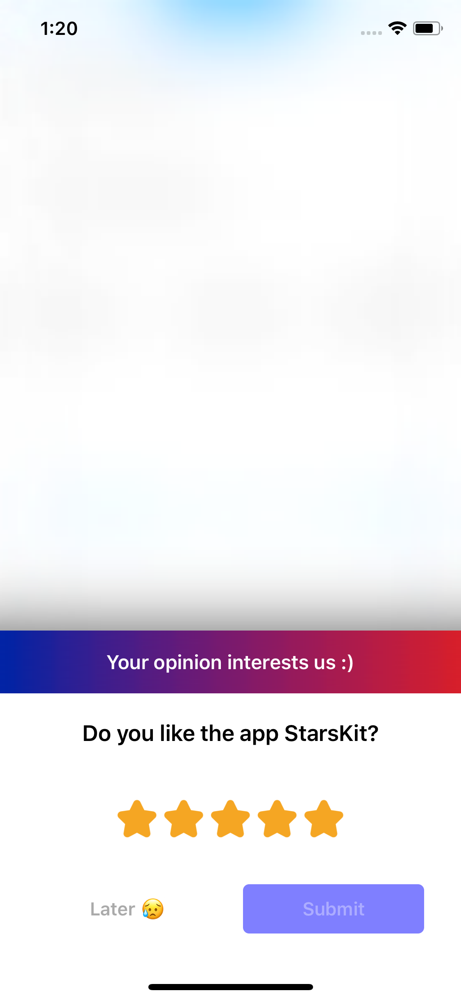
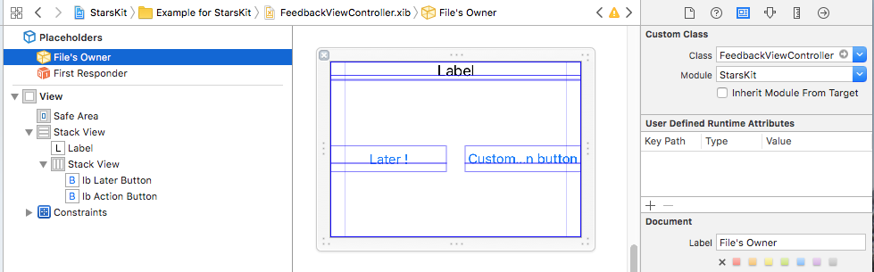
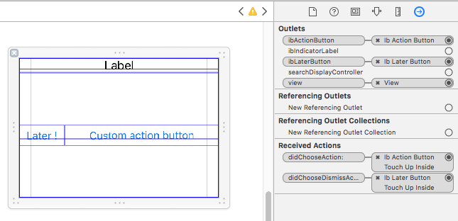

# StarsKit

[](https://travis-ci.org/smartnsoft/StarsKit)
[](http://cocoapods.org/pods/StarsKit)
[](http://cocoapods.org/pods/StarsKit)
[](http://cocoapods.org/pods/StarsKit)


### Look at this beautiful MouSTARche!

StarsKit is a Swift library to simplify, customize and configure your app rating workflow.

It can be based on a remote, local or static configuration data with optionnals properties.

<p align="center">  </p>

## Requirements

- iOS 9.0+
- Swift 4+
- Xcode 9.2+

## Example

To run the example project, clone the repo, and run `pod install` from the Example directory first.

## Installation

StarsKit is available through [CocoaPods](http://cocoapods.org). To install
it, simply add the following line to your Podfile:

```ruby
pod 'StarsKit'
```

## Third party dependencies

Today we have third parties dependencies, but the purpose is to avoid them the most.

To have a quick available library and significant customization, we use 3 dependencies:

- [Extra/UIKit](https://github.com/smartnsoft/Extra): our library to simplify UIKit operation code
- [Jelly](https://github.com/SebastianBoldt/Jelly): a simple UI component to simplify the rating transition display
- [Cosmos](https://github.com/evgenyneu/Cosmos): a powerful and flexible stars slider UI component

## Description

### Behavior

The main feature of the library is to **simply use static or dynamic (remote) configuration to show native or custom app rating screen**.

If the user chooses a negative rate, he will be redirected to the **feedback screen**.
If the user chooses a positive rate, he will be redirected to the **Store review sreen**.

You and only you choose what to do when the user choose to give a feedback, like:

- send a an e-mail
- launch your own feedback screen

It's the same when the user chooses to rate the app: 

- redirect the user on the AppStore review page
- call a custom analytics

### Native StoreKit screen

You can also display the native `StoreKit` screen instead of custom screens (iOS 10.3+ only):

<p align="center"></p>

### Features list

- [X] Use localizable or configuration strings
- [X] Default localizables strings : 
- - [X] EN
- - [X] FR
- [X] Overridable localizables strings
- [X] Static configuration strings
- [X] Cocoapods integration
- [X] Default & configurable step transitions
- [X] Default display algorithm behavior
- [X] Customizable display algorithm behavior
- [X] Customizable stars style
- [X] Customizable fonts, text & tint colors
- [X] Rating & screen actions callbacks
- [X] Configurable with dictionnary / data or remote URL: everything you want!
- [X] Native iOS 10.3+ StoreKit integration
- [X] Overridable layouts
- [X] Life cycle display events ([will/did]appear/disappear)
- [ ] Additionnal condition checking on the default check
- [ ] Carthage integration

## Configurable metrics for display

You can specify metrics to trigger the default display behavior or use your own one.

- [X] Disable / enable the component
- [X] Increment sessions counter
- 5X] Increment crashes counter
- [X] Static configuration strings
- [X] Days without crashes
- [X] Days before asking again
- [X] Number of reminding
- [X] Maximum of days betwteen session count
- [X] Step 1: Rate screen properties
- [X] Step 2: Feedback screen properties
- [X] Step 3: Store review screen properties

## Usage

### Display the rating

```
// Simply call:
StarsKit.shared.displayRateIfNeeded()

// You can also force the display via:
StarsKit.shared.displayRateIfNeeded(forced: true)
```
### Update the configuration properties

See also : `StarsKitProperties` enum keys.
You have to conform the data dicitonnary to the expected keys.

**StarsKit offers you the possibility of using any configuration source**: local JSON file, static dictionnary, remote file (remote JSON or Firebase remote configuration file).

To update the configuration, simply give the dictionnary data :

``` swift
let data = try Data(contentsOf: URL(fileURLWithPath: path))
let localJSONConfiguration = try JSONSerialization.jsonObject(with: data, options: .allowFragments) as! [String: Any?]
StarsKit.shared.updateConfig(from: localJSONConfiguration)
```

### `StarsKit` instance & configuration

Today StarsKit manages a default singleton instance.

You can set-up your own `configuration`, `context` and `graphicContext` for StarsKit.

You can also decide of:

- **`validateRatingButtonEnable`**: disable or enable the submit step rating. If disable, the rate will be instantly submit after touch.
- **`useDefaultBehavior`**: disable the default StarsKit display checking behavior and implement your own in the `StarsKitDelegate`
- **`priorityUseNativeRate`**: enable the native rating in iOS 10.3+, if not available, it will use the StarsKit screens 👌🏼
- **`useSessionSpaceChecking`**: disable/enable the default checking of time ellapsed between sessions. If enable, when you update the session count, **the session count will only be updated if the time between session is completly ellapsed.**
- **`localLocalizableStringsEnabled`**: enable the localization titles instead of configuration one. It will use the default StarKit strings. If you override them in your app localizable strings (with the same key), it will take them 😎.

### `StarsKitContext`: update the metrics 

To trigger the pop-up rating display, you have to update the metrics.

``` swift
// Increment the number of crash, this will automatically update the last crash date (lastCrashDate)
StarsKit.shared.context.nbCrashes += 1

// Increment the session directly
StarsKit.shared.context.nbSessions += 1
// or
StarsKit.shared.incrementSession(by: 10)

// You can also reset all the app context values
StarsKit.shared.resetContext()

// You can also reset all the configuration properties
// After a new major version update for instance
StarsKit.shared.resetConfig()
```

## Customization

### Use `StarsKitGraphicContext`

Customizable items :

- titles fonts
- titles colors 
- button tintColor
- button backgroundColor
- header background image
- ViewController presentation transition (via Jelly)
- Stars style (via Cosmos)

### Transitions & display (Jelly)

StarsKit use Jelly fro customizable transitions. You can specify your own via the  the   `jellyCustomTransition` property in the `StarsKitGraphicContext`.

<p align="center"> </p>

Go to [Jelly repo](https://github.com/SebastianBoldt/Jelly) for more informations.

### Stars (Cosmos)

Cosmos provide a `CosmosSettings` property that can be set in the `StarsKitGraphicContext`.

You specify you own stars image, if nil, Comsmos will use the specifed star path via `starPoints`.

<p align="center"></p>

Go to [Comos repo](https://github.com/evgenyneu/Cosmos) for more informations.

### Step screens

- Simply create the desired xib screen, with the same name than in StarsKit.
- Sepcify the custom class and the module as "StarsKit".
- Uncheck "Inherit Module From Target"

IBOutlet are optionnals, so you can decide if you want to implement them or not.

<p align="center"></p>

<p align="center"></p>

**Note**: if you want to test it in the demo project, simply check the `FeedbackViewController.xib` in the StarsKit-Example target.

### Override localizable strings

Simple add in your Localizable strings the localizable key(s) to override

See the default `StarsKit.strings` keys.

```
"starskit.mainTitle" = "My overrided title";
```

### Override step controllers

### `StarsKitDelegate` : listen to rating callbacks


``` swift
// MARK: - StarsKitDelegate
extension ViewController: StarsKitDelegate {
  func didValidateRating(to rate: Int) {
  	// Why not send an analytic ?
    print("Did validate rating to rate \(rate)")
  }
  
  func didChooseAction(at step: RatingStep) {
    print("Did choose action button at step \(step)")
  }
  
  func didChooseLater(at step: RatingStep) {
    print("Did choose later button at step \(step)")
  }
  
  func needCustomDisplayRateScreen() -> Bool {
    //Implement your own behavior if you want
    return false
  }
  
  func didUpdateRating(from context: StarsKitContext, to rate: Int) {
    print("Did update rating at \(rate)")
  }
  
}
```

### `StarsKitUIDelegate` : listen to UI cycle events

``` swift

// MARK: - StarsKitUIDelegate
extension ViewController: StarsKitUIDelegate {
  
  func didRatingScreenWillAppear() {
    print("didRatingScreenWillAppear")
  }
  
  func didRatingScreenDidAppear() {
    print("didRatingScreenDidAppear")
  }
  
  func didRatingScreenWillDisappear() {
    print("didRatingScreenWillDisappear")
  }
  
  func didRatingScreenDidDisappear() {
    print("didRatingScreenDidDisappear")
  }
  
  func presenterController() -> UIViewController {
    // Return the controller where the rate screen will be presented
    // The current, the top most one, anywhere, anyone
    return self
  }
}
```

## Contributors

Made in 🇫🇷 by the [Smart&Soft](https://smartnsoft.com/) iOS Team

- Jean-Charles Sorin - Smart&Soft

## License

StarsKit is available under the MIT license. See the LICENSE file for more info.
